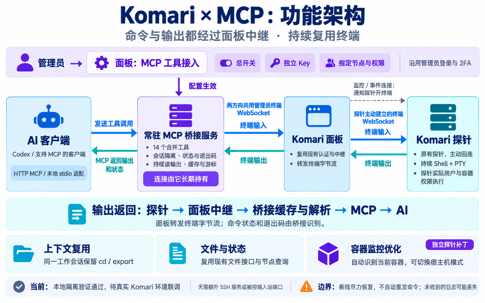
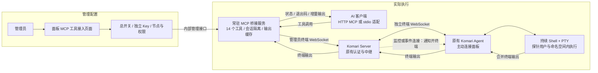

# Komari × MCP 功能架构

AI 客户端把命令交给常驻 MCP 桥接服务；桥接服务复用 Komari 已有管理员终端、面板中继与探针主动回连。一次建立工作会话，后续工具调用继续使用同一个远端 shell。

输出严格逐层返回：**探针 → Komari 面板中继 → 常驻桥接服务 → MCP → AI 客户端**。探针不直接连接 AI。图中每段返回箭头都应连接相邻模块，不能从中间模块下方绕过。

| 返回段 | 使用的通道 | 处理内容 |
| --- | --- | --- |
| 探针 → 面板 | 探针主动建立的独立终端 WebSocket | PTY 读取出的合并终端字节流 |
| 面板 → 桥接 | 已建立的管理员终端 WebSocket | 面板中继终端消息，不识别每条命令的退出码 |
| 桥接 → AI | HTTP MCP 工具结果；或本地 stdio 适配器转交 MCP 结果 | 桥接持续读输出并缓存；工具调用返回增量输出、游标与可确认的命令状态 |

长任务未结束时，一次 MCP 调用可以先返回；桥接继续读取上游，AI 后续调用 `komari_output_read`。这不是探针把 WebSocket 直接暴露给 AI，也不表示当前 HTTP MCP 实现主动向客户端推送每一个终端帧。

源码对应：面板 `web/api/terminal/forward.go` 的 `ForwardTerminal` 在两侧 WebSocket 之间转发；桥接 `bridge/internal/terminal/session.go` 持续 `ReadMessage` 并解析缓存；`bridge/internal/app/app.go` 提供 HTTP MCP，`stdio.go` 提供可选本地适配。

下方 Mermaid 保留可修改的准确调用关系。

## 各部分的职责

| 部分 | 已实现职责 | 边界 |
| --- | --- | --- |
| AI 客户端 | 调用 MCP 工具，指定节点与工作会话，继续读取长任务输出 | 客户端须实际支持远程 MCP，或运行本地 stdio 适配进程 |
| 常驻桥接服务 | 14 个合并工具；独立 Key、节点授权；持续连接、命令记录、输出游标与有限缓存 | 工具调用结束不会销毁 PTY；上游管理员 API Key 保存在桥接端 |
| 面板管理增量 | 总开关、Key 创建与禁用、节点和权限选择；沿用管理员登录及敏感操作 2FA | 页面和代理是新增代码；尚未真实浏览器与已开启 2FA 的账户联调 |
| Komari 原有服务 | 管理员终端入口、探针通知、中继、原生文件 RPC 与传输接口 | 实际部署版本须具备这些接口，并包含历史 API Key 终端修复 |
| Komari 原有探针 | 收到通知后主动建立独立终端连接，启动和读取 shell/PTY | 执行权限取决于探针进程用户和所在容器；不自动取得宿主机权限 |
| 可选容器监控补丁 | 自动选择容器统计范围，允许显式宿主机覆盖 | 独立于 MCP；不扩展执行权限，实际容器资源限制仍待验证 |

## 14 个工具放在哪里

这些工具运行在桥接服务里，未把 RHMCP 的 65 个工具逐个装入 Komari 探针。

| 能力 | 工具 |
| --- | --- |
| 节点与能力查询 | `komari_nodes_list`、`komari_capabilities` |
| 工作会话管理 | `komari_session_open`、`komari_session_status`、`komari_sessions_list`、`komari_session_close` |
| 命令和增量日志 | `komari_command_run`、`komari_output_read` |
| 简单交互与控制 | `komari_terminal_input`、`komari_command_interrupt`、`komari_terminal_resize` |
| 文件与主机状态 | `komari_filesystem`、`komari_file_read`、`komari_host_inspect` |

文件工具走已有 RPC/文件传输接口；持续终端走独立 WebSocket，不能把两者都说成监控 RPC 内的终端字节流。

## 为什么不会每次冷启动

`komari-mcp serve` 是真正持有上游 WebSocket 的常驻进程。HTTP MCP 请求或本地 stdio 适配器的生命周期不决定远端 PTY 的生命周期。相同调用方、节点和工作会话复用原会话，不同工作任务相互隔离。

正常连接下，受支持的 Linux POSIX shell 命令在同一个 shell 内执行，`cd`、`export` 和函数定义可保留。命令完成由桥接层的开始/结束标记和退出码解析识别；PTY 本身不提供结构化完成事件。没有可信结束标记时返回不确定状态。

桥接服务可以运行在面板宿主机、同一 Docker 网络或其他能访问面板的常驻机器。被控端继续主动访问面板，不要求新装 SSH 服务或增加被控端入站端口。外部 MCP 访问和内部管理端口应分别配置。

## 验证与能力边界

2026-10-05：本地协议模拟、真实本地 PTY、官方 MCP SDK、实际桥接二进制测试通过；面板代理与容器指标夹具测试通过。尚未完成用户真实 Komari、实际 2FA 账户、反向代理、Docker/systemd 部署联调。

- 短暂断线尽力重连，使用上下文检测确认 shell 连续性；相同 `request_id` 单独不能证明原 shell 保留。
- 不自动重发可能已执行的命令；重复 `command_id` 查询已有记录，不能承诺原始 PTY 输入端到端恰好执行一次。
- 桥接缓存仅能保存实际收到的输出；原探针断线期间未传回的日志不能凭空补回，状态会标明缺口。
- 工具等待超时不会自动杀任务。Ctrl+C 和关闭远端会话是明确动作，但现有协议没有强取消确认。
- 输出与历史有资源上限；完整断线回放、持久后台任务、完整 TUI 和文件大批量传输属于后续增强。

完整配置和限制见 [桥接开发版说明](./README.md)，已执行检查见 [验证记录](./validation-results.json)。

## 本轮稳定性增量

监控持续保活，终端按工作会话创建并复用。新增面板及探针终端两侧协议保活、限时写与连接替换/计时器竞态修复；不是把终端流量移入监控 RPC。详细变更、资源开销和真实限制见 [STABILITY.md](./STABILITY.md)，详细图见 [architecture-detailed.png](./docs/architecture-detailed.png)。

## 执行保护增量（2026-10-08）

当前工具数为15，新增 `komari_execution_policy`。上方图片是此前14工具阶段的示意，新增保护以 [执行策略说明](EXECUTION_POLICY.md) 为准。MCP初始化提供简短规则，设备资源和永久配置由面板／桥接提供；临时工作租约由桥接维护，探针新增共享槽位池、受管理命令的本地期限和官方任务输出上限。`mcp_hello`／`mcp_arm`／配置确认仍经过管理员终端 → 面板中继 → 探针终端连接；没有探针直连AI或另开被控端入站服务。
